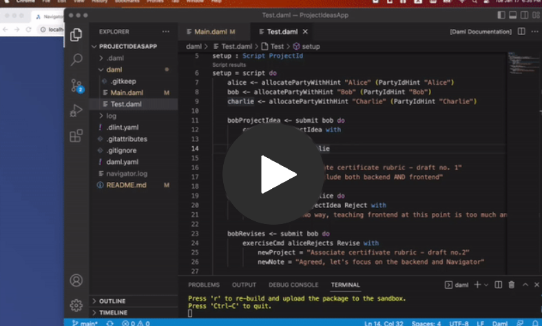

# Project Ideas App
Daml templates designed for a platform for proposing project ideas to get rejected/approved.

### I. Overview 
This project was created by using the `empty-skeleton` template. The project adopts and exemplifies the `proposal-accept` design pattern. A signatory can create a ProjectIdea contract. Then they can exercise the Propose choice as a controller to get the project proposal either approved or rejected by their manager. If the manager, a controller, exercises Reject choice on the proposed contract, the employee can exercise Revise choice on it to re-propose the project with updated details. Upon manager exercising Accept choice, a Project contract is created.

### II. Workflow
1. An employee creates a ProjectIdea contract. Both colleague and manager are invited as obeservers, but manager, as a controller, is authorized to exercise either Reject or Accept choices.
2. Upon the controller exercising Reject, a new contract is created.
3. Revise choice can be exercised on the newly generated contract from above.
4. Accept choice is exercised to finalize the project idea and generate a new Project contract.

[](https://share.vidyard.com/watch/xbDuZMbNUbgfHmPnqzt72N?)

### III. Challenge(s)
* `controller ... can` syntax causes warning in Daml 2.0+. The code itself does not cause any issues/errors in 2.5.0 but according to the warning, the syntax will be deprecated in the future versions of Daml. More information [here](https://docs.daml.com/daml/reference/choices.html#daml-ref-controller-can-deprecation).
* The new controller syntax requires a controller to be an observer first before they can exercise a choice, otherwise it'll throw an error: "Attempt to fetch or exercise a contract not visible to the committer." For more information, check out [this post](https://discuss.daml.com/t/error-attempt-to-fetch-or-exercise-a-contract-not-visible-to-the-committer/1304/1) on the Daml Forum.
* The project was created by using `empty-skeleton` and the following was removed from `daml.yaml`:
```
sandbox-options:
   - --wall-clock-time
```
and replaced with the following:

```
exposed-modules:
  - Main
navigator-options:
 - --feature-user-management=false
```
For more info, check out [this post](https://discuss.daml.com/t/sandbox-options-wall-clock-time/5692/16?u=cathy_jung) on Daml Forum and [Daml Doc](https://docs.daml.com/tools/navigator/index.html?&_ga=2.48248804.337210607.1673989679-241632404.1672853064&_gac=1.17025355.1673455980.CjwKCAiA2fmdBhBpEiwA4CcHzfI2w1_D95zAr3_d6QTypOMXGTpUxtS06c55inucNwZvUZn4AebsJxoCZEgQAvD_BwE&_gl=1*elem6v*_ga*MjQxNjMyNDA0LjE2NzI4NTMwNjQ.*_ga_GVK9ZHZSMR*MTY3Mzk5NDQzOS4zMS4xLjE2NzM5OTQ3MDcuMC4wLjA.#logging-in-as-a-party).


### IV. Building
To compile the project
```
$ daml build
```

### V. Testing
To test all scripts:
Either run the pre-written script in the `Test.daml` under /daml OR run:
```
$ daml start
```

### VI. Running
To load the project into the sandbox and start navigator:
```
daml start
```